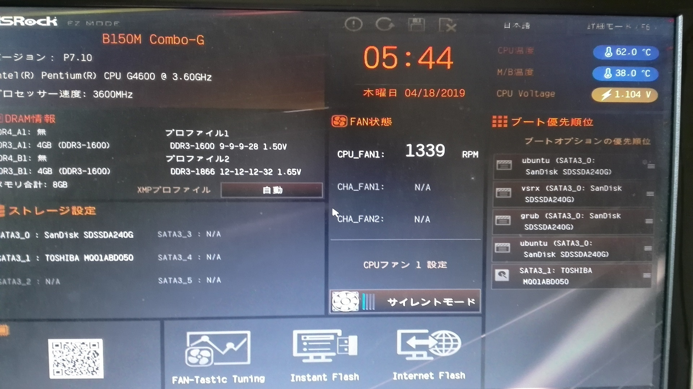
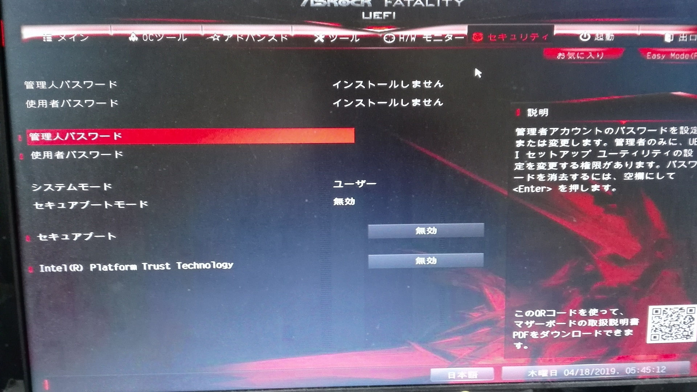

.. Valkyrie Linux documentation master file, created by
   sphinx-quickstart on Wed Feb  3 19:35:57 2016.
   You can adapt this file completely to your liking, but it should at least
   contain the root `toctree` directive.

Valkyrie Linux
=========================

Valkyrie Linuxは、Linuxディストリビューションである「Ubuntu LTS版」をベースに開発した64bit OSです。

デスクトップ環境は、LXQtを採用しています。

このOSは、最新のLinuxカーネルをベースにしたカスタムカーネルを搭載しています。カスタムカーネルは、グラフィックドライバ「Mesa 21」と最新のLinux Firmwareを組み合わせる事で、高レスポンス性とハイパフォーマンスを実現しています。
Valkyrie Linuxは、「人工知能プログラムの開発環境・実行環境の提供」、「Linux・Windowsのアプリケーションの実行環境の提供」、「ソフトウェア開発・Web開発環境の提供」、「マルチメディアコンテンツ作成環境の提供」、「先端的な科学技術・データサイエンス環境の提供」、「ゲーミング環境の構築」を実施しています。

「Chromium Browser」「GIMP」「SM Player」「Audacious」「Emacs」「OBS Studio」「Shotcut」「Avidemux」「Steam」などの人気アプリケーションを搭載しており、デスクトップコンピューティングで行う作業をほぼカバーしてます。SSB(Specific site Browser)によって、
強力なオンラインサービスをデスクトップアプリケーションのように使う事が可能です。
オリジナルアプリケーション「Viper Tools」でシステム起動音の変更、新しいアプリケーションの追加から人工知能による自動文章構築と読み上げまでを行えます。

Valkyrie Linux is a 64bit OS which was developed based on the "Ubuntu LTS", which is a Linux distribution.

The desktop environment of this OS has been adopted LXQt.

This OS is equipped with a custom kernel based on the latest Linux kernel.The custom kernel realize high response and high performance by combining it with the graphic driver "Mesa 21" and the latest Linux Firmware.
Valkyrie Linux is carried out the "providing development environment and execution environment for artificial intelligence programs",
"providing execution environment for Linux/Windows applications", "providing software development and web development environment",
"providing multimedia contents creation environment , "Providing cutting-edge science and technology/data science environment","building a gaming environment".

It is equipped with popular application such as "Chromium Browser","GIMP","Shotcut","SM Player","Audacious","Emacs","OBS Studio","Shotcut","Avidemux","Steam",etc.
This os almost covers work to perform by desktop computing. By SSB(Specific site Browser), it can use the strong online service like desktop application.
Valkyrie Linux can perform automatic sentence construction and reading aloud with the artificial intelligence from a change of the system startup sound,
addition of new application in original application "Viper Tools".

http://www.valkyrieviper.space/article/418075361.html

Recommended system requirements
--------------------------------------------------

Processor :
    Intel Core i,Pentium G/Celeron G,Atom SoC

    AMD Ryzen

Memory: 2GB and over

Storage: 128GB and over HDD/SSD/USB memory

Network: FTTH・ADSL・LTE・WiMAX2+ etc.

Tested Motherboard
---------------------------------

B150-COMBO(ASRock)

H97I-PLUS(ASUS)

C1007UN-D(GIGABYTE)

[Tested Motherboard]

B150M COMBO(ASRock)

H97I-PLUS (ASUS)

C1007UN-D (GIGABYTE)

[Tested Stick PC(stable with wireless LAN toggle)]

STCK1A32WFC(Intel)

Based Linux destribution
-----------------------------------

Ubuntu 18.04.5 LTS

Kernel
------------

◎Noir linux Kernel 5.11.11
::
  ◇based kernel
    linux kernel 5.11

  ◇Applied patches
  - CPU shceduler -> PDS
  - Default I/O scheduler -> Kyber
  - Processer family -> Generic X86_64
  - Kernel Compression mode -> zstd
  - Preemption Model -> Preemptible Kernel(lowlatency desktop)
  - CPU Timer frequency -> 750Hz
  - RCU boost delay -> 339
  - Compiler optimization level -> Optimize for more performance(-O3)
  - Timer tick handling -> Full dynticks system
  - Enable utillization clamping for RT/FAIR tasks
  - UKSM support
  - Default CPUFreq Governor -> performance
  - HD-audio pre-allocated buffer size 4096
  - BBR2 TCP Congestion Control
  - Built on the GCC 10.2.0
  - CPU idle governor -> TEO
  - PCIe ACS Override support
  - futex for Wine/Proton support
  - ZSTD kernel and initram support
  - TSX -> auto
  - Aufs support
  - Zen Interactive Tuning support
    Mem dirty before bg writeback 10% -> 20%
    Mem dirty before sync writeback 20% -> 50%
    Background-reclaim hugepages no -> yes
  [CFS CPU Scheduler]
    Scheduling latency 6 -> 4ms
    Minimal granularity 0.75 -> 0.4ms
    Wakeup granularity 1 -> 0.5ms
    CPU migration cost 0.5 -> 0.25ms
    Bandwidth slice size 5 -> 3ms
    Task rebalancing threshold 32 -> 256
    Ondemand sampling down factor 1 -> 5
  [MuQSS CPU Scheduler]
    Scheduling interval 6-> 4 ms
    ISO task max realtime use 70 % -> 25 %
    Yield type 1 -> 0
  - Meltdown,spectre_v1,spectre_v2 : Mitigation
  - Clear Linux support
  - rt_runtime 95000 -> 98000
  - rq_affinity 2
  -Aufs support

PPA
-----------

::

    Ubuntu PPA
    PPSSPP PPA
    Avidemux PPA
    Atom PPA
    BootRepair PPA
    Docker PPA
    Wine HQ PPA
    GIMP PPA
    OBS Studio PPA
    Lutris  PPA
    LibreOffice PPA
    Inkscape PPA
    StepMania PPA

OS SPEC
-------------

::

    - Ubuntu 18.04.5 LTS based
    - Custom kernel "Noir linux kernel 5.11.11" / Ubuntu kernel 5.8.0 lowlatency
    - original application "Viper Tools"
    - linux firmware 1.190.4
    - Mesa 21.0.1
    - LXQt
    - Tint2
    - Openbox
    - gmrun,dunst
    - xfce4-terminal,xfce4-taskmanager,xfce4-screenshooter
    - Intel iHD Driver 21.1.0

Applications
-----------------

::

    - Chromium Browser 89,Firefox 87
    - emacs-nox 27.1,leafpad,glade
    - pulseaudio,jackd2
    - GIMP 2.10.22
    - GCC 10.2.0,Python 3.6.9/3.9.0/2.7.18,node.js,libllvm11/10,PHP 8.0,node.js
    - Wine 6.0.0
    - OBS Studio,Shotcut,Audacious,Audacity,soundconverter,Blender 2.92,mpv 0.33,ffmpeg 4.3.1,SMPlyer 20.6.0
    - Steam,PCSX2,PPSSPP,mednafen,kega fusion,redream
    - gnumeric,abiword
    - keepassxc
    - unetbootin,gparted,boot-repair,gnome disks
    - git 2.30
    - X11VNC,remmina
    - apache2.4.29
    - OpenJtalk
    - Arronax
    - Thunderbird

icons
--------

::

    - Suru++

Fonts
--------

::

    - Takao font
    - font noto-emoji
    - font noto cjk
    - font noto cjk extra
    - Cica

○オリジナルアプリ::
    Python製アプリケーション:Viper Tools

◯Webアプリ::
    DP-IP
    Animizer
    Wifu2x
    Insecam
    IP hiroba
    Youtube
    Google Maps
    Google translation
    BROARDBAND  Speedtest
    Animizer
    Wifu2x
    MSI電源容量計算機

○オプション（未定）
人工知能の開発環境「Brunhild」
 Python用機械学習ライブラリ:scikit learn,CPU版Tensor Flow,Keras

○キーボードショートカット::

 ・Shift+Alt+Left - 現在のウィンドウを左隣の仮想デスクトップに移動
 ・Shift+Alt+Right - 現在のウィンドウを右隣の仮想デスクトップに移動
 ・Windowsキー+1 - 仮想デスクトップ1に移動
 ・Windowsキー+2 - 仮想デスクトップ2に移動
 ・Windowsキー+3 - 仮想デスクトップ3に移動
 ・Windowsキー+4 - 仮想デスクトップ4に移動
 ・Windowsキー+5 - 仮想デスクトップ5に移動
 ・Windowsキー+6 - 仮想デスクトップ6に移動
 ・Windowsキー+d - 現在開いているウィンドウを全てタスクバーに収納、あるいは展開する
 ・Windowsキー+Shift+c - 現在アクティブなウィンドウを閉じる
 ・Windowsキー+Escape - 最も下のレイヤーにあるウィンドウを最上位に移動
 ・Windowsキー+space - ウィンドウメニューの表示
 ・Windowsキー+f - fbpanel再起動
 ・Print - スクリーンショットの撮影
 ・Alt+Print - アクティブウィンドウのスクリーンショットの撮影
 ・Windowsキー+k - 次のウィンドウに移動
 ・Windowsキー+j - 前のウィンドウに戻る
 ・Ctrl+m - Openboxのルートメニューを表示
 ・Ctrl+Alt+Return - ウィンドウを最大化
 ・Ctrl+Alt+Shift+Return - ウィンドウを最小化
 ・Ctrl+Windows+u - 音量を上げる
 ・Ctrl+Windows+i - 音量を下げる
 ・Ctrl+space - コマンドランチャー「gmrun」起動
 ・Windowsキー+Return - 端末を起動
 ・Windowsキー+c - Chromiumの起動
 ・Windowsキー+p - PCManFMの起動
 ・Windowsキー+a - Audaciousの起動
 ・Windowsキー+e - Emacs noxの起動

インストール方法
===============
◇インストール方法
1.ISOをダウンロード（OneDriveのアカウントが無くてもダウンロードは出来ます。右クリックメニューで「ダウンロード」の項目を選択して下さい。）

2.UNetbootinでUSBメモリーにインストールディスク(Live USB)を作成。

https://unetbootin.github.io/

3.Live USBをパソコンのUSBポートに挿入して、UEFIからLive USBで起動出来るように、USBメモリーから起動出来るようにする。（メーカーロゴが出ている時にF11キーなどを押す。）

4.Live USBでシステムを起動。余計な物をインストールしないようにし、高速にインストールする為にネットを切っておく。トラブルを防止出来ます。

5.右クリック→「Install PVL」→インストール

6.OSのインストールが終わった後に出てくるダイアログで「試用を続ける」を選択する。選択後に自動的にboot-repairが起動。

7.「高度なオプション」→「GRUBのオプション」→「SecureBoot」のチェックを外して、適用ボタンを押す。

8.GRUBをインストールしたら、システムの再起動（エラーが出ていてもGrub2はインストールされているので問題無く起動出来ます。）。
homeディレクトリを別にした状態で、再インストールをしている時は、/etc/skelの下にあるファイルやフォルダを全てユーザーディレクトリにコピーしなければ反映されません。

セキュアブートの無効化
===================

1.パソコンを起動させた時にメーカーのロゴが表示されるので、この時にF2キーかDeleteキーを押す。

.. image:: ../_images/uefi001.jpg

2.UEFIに入るので、詳細モードに変更する。（使っているマザーボードによって異なります。）

3.セキュリティ関連の項目にセキュアブートの設定項目があるので、これを選びます。

4.保存して再起動させると、セキュアブートが無効化されてシステムを起動する事が出来ます。

64bit OS「Valkyrie Linux」の特長
=========================

* デスクトップ環境は、LXQtを採用しています。

  デスクトップ環境がLXQtを採用していて、ウィンドウマネージャーはOpenboxです。デスクトップ環境のXfceなどから様々なアプリケーションを使っています。また、fbpanelやgmrunやnitrogenもデスクトップの構築に使っています。

  メモリー使用量を減らす事で、アプリケーションを使う時に必要なメモリーをより多く確保する事が出来ます。

* Linuxカーネルは、最新のLinuxカーネルベースの高レスポンス性が高いカスタムカーネルを搭載。

* Mesa 20の導入により、WineやPCSX2などで3Dゲームを動作させた時のパフォーマンスが大幅に向上しています。

* VDAPU及びVAAPI対応ドライバを採用している為、動画支援機能で低CPU負荷で動画を再生出来ます。

* サウンドは、PulseAudioとJack Audio Connection Kitをプラグイン経由で出力する仕組みになっています。

  また、Openboxの右クリックメニューからPulseAudioやJack Audio Connection Kitを起動・停止させられ、両方のサウンドサーバの併用も可能です。

* Pythonとシェルスクリプトで開発したオリジナルアプリケーション「Viper Tools」を搭載。

  リマスター機能やカスタムカーネルビルド機能、アプリケーションのインストール、人工知能プログラムによる文書作成と音読、宝くじなどの予想機能、画像・動画の変換機能などを有しています。

* Ubuntuの長期サポート版（LTS）のリポジトリと共有していますので、Main,RestrictedのコンポーネントをUbuntuの公式サポートで最新の状態に維持しています。更にPPAから最新のバージョンのアプリケーションを導入しています。

* Specific Site Browser機能で人気のWebアプリケーションをデスクトップアプリケーションのように使えます。

* PSPやPS2やPSのゲームエミュレーション、PlayOnLinux+Wineによる古いWindowsアプリケーションの利用が可能です。

* GIMPやAvidemuxやHandbrakeなどWindowsやLinuxなどでお馴染みのアプリケーションをフル装備しています。最初からプログラミング・オフィス文書作成・イラストレーション・画像編集・動画エンコード・動画編集・音楽再生・3Dモデリング・オンラインサービスの利用する事が可能です。

* UEFIモードでLiveUSBやハードディスクへのフルインストールでの起動が出来るようになっていますので、ほとんどのマザーボードに対応

* WebブラウザにはChromium Browser、WebサーバのApacheなどを装備し、Web開発環境を整えています。

* Atom、EmacsやLeafpadなど複数のテキストエディタを搭載し、PythonやPHPやJavaなどのプログラミング言語でプログラミングを行える環境を整えています。

* メインサイトとの連携

* 日本語入力環境にMoscとFcitxを採用

Valkyrie Linuxの高速化と最適化
========================

64bit OS「Valkyrie Linux」は、LTS版Ubuntuをベースに数多くの高速化・最適化策を講じています。

Ubuntu LTSをベースにして開発したオリジナル64bit OS「Valkyrie Linux」には、様々な高速化テクニックを導入しています。

1.Ubuntuパッチが当たっているLinuxカーネルのソースコードを使って、最適化ビルドしたカスタムカーネルの導入

Linuxカーネルを更に最適化する

64bit OS「Valkyrie Linux」用のカスタムカーネルを作成

2.デスクトップ環境をOpenbox+fbpanel+Xfce/LXDE/GNOME用アプリで構成

3.prelink、preloadでアプリケーションのキャッシュデータを使って先読み

4.tmpfsでRAMDiskをブラウザのキャッシュ場所として活用

5./etc/sysctl.confの最適化

6.サウンドシステムは、サウンドサーバを通さずに、ALSAを直接使えるようにしています。

サウンドサーバが必要な場合には、「PulseAudio」「Jack Audio Connection Kit」をウィンドウマネージャー「Openbox」の右クリックメニューから手動で起動出来るようにしました。

7./etc/init.d/rcに「CONCURRENCY=shell」を設定して、システム起動時のモジュールの並列起動

8.VAAPIとVDPAUの導入で動画支援機能の利用(mesa-va-drivers、mesa-vdpau-drivers)

9.ccacheでGCCによるコンパイルの高速化

10.Emacsをnox版で使う

11.CPUスケジューラーにMuQSSを適用してカーネルをビルドした時、パフォーマンス向上させる設定として、以下を/etc/sysctl.confに追加。

    kernel.yield_type = 2

    kernel.interactive = 0

Valkyrie Linuxの高音質化
====================

PulseAudioとJACK Audio Connection Kitをモジュールで接続し、Openboxの起動スクリプトからこれらを起動させたり、PulseAudioのデーモンをRAMDISKに配置したりして高音質化を図っています。

高音質化部分は以下の通りです。::

    #JACK+PulseAudio
    sleep 5;jack_control start &
    sudo schedtool -R -p 49 `pidof jackdbus`
    jack_control eps realtime true
    jack_control ds alsa
    jack_control dps device hw:0
    jack_control dps rate 96000
    jack_control dps nperiods 2
    jack_control dps period 1024
    sleep 5;pactl load-module module-jack-sink channels=2
    pactl load-module module-jack-source channels=2
    sleep 3;pacmd set-default-sink jack_out
    pacmd set-default-source jack_in

   sleep 2;ln -s /usr/bin/pulseaudio /tmp &
   sleep 10;/tmp/pulseaudio --start &

Valkyrie Linuxのインストールの時にGRUBをインストールするのに失敗した場合の対処法
======================================================================

EFIパーティションの状況によって、システムインストール時にGRUBが正常にインストールされない事があります。
その時には、Valkyrie Linuxに収録しているboot-repairを使ってGRUBをインストールする事が出来ます。::

       1.右クリックメニューでboot-repairを選択します。
       2.boot-repairが起動したら、「高度なオプション」を選択し、適用を押します。
       3.GRUBのインストールが行われます。最後に正常にインストール出来なかったという内容のメッセージが表示されますが、そのまま、システムを再起動させます。
       4.正常にシステムが起動出来るようになっています。
